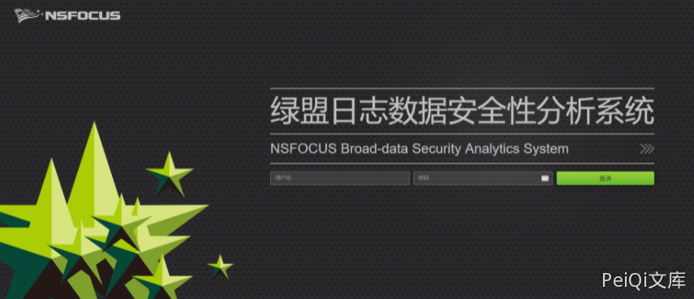
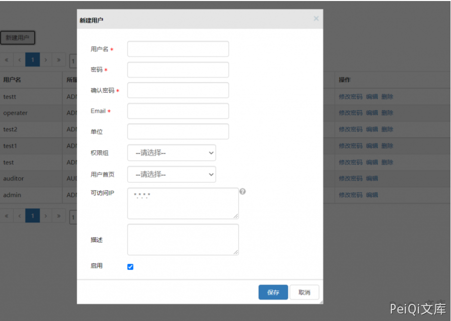
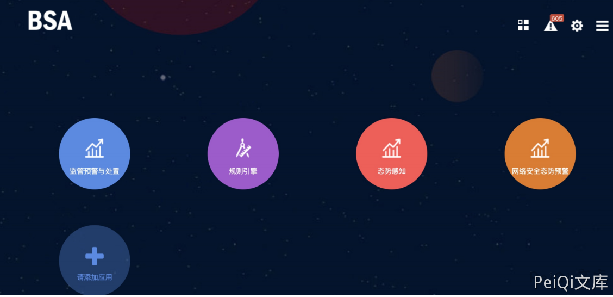

# 绿盟 BAS日志数据安全性分析系统 accountmanage 未授权访问漏洞

## 漏洞描述

绿盟 BAS日志数据安全性分析系统存在未授权访问漏洞，通过漏洞可以添加任意账户登录平台获取敏感信息

## 漏洞影响

<a-checkbox checked>绿盟 BAS日志数据安全性分析系统</a-checkbox></br>

## 网络测绘

<a-checkbox checked>body="WebApi/encrypt/js-sha1/build/sha1.min.js"</a-checkbox></br>

## 漏洞复现

登录页面





未授权页面


```plain
/accountmanage/index
```


添加用户并登录





使用账户登录后台

