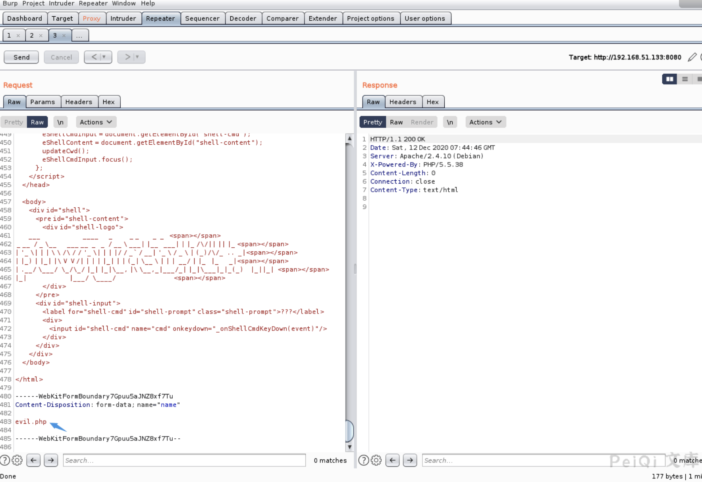

# Apache HTTPd 换行解析漏洞 CVE-2017-15715

## 漏洞描述

Apache HTTPD是一款HTTP服务器，它可以通过mod_php来运行PHP网页。其2.4.0~2.4.29版本中存在一个解析漏洞，在解析PHP时，`1.php\x0A`将被按照PHP后缀进行解析，导致绕过一些服务器的安全策略。

## 漏洞影响

<a-checkbox checked>Apache HTTPd  2.4.0~2.4.29版本</a-checkbox> 

## 网络测绘

<a-checkbox checked>
<a-button href="https://fofa.info/result?qbase64=c2VydmVyPSJBcGFjaGUvMi40LjQ5IiA%3D">server="Apache/2.4.49" </a-button>
</a-checkbox>

## 漏洞复现

直接上传恶意文件会被拦截

抓包修改如下参数

响应为200，成功绕过

访问 `http://xxx.xxx.xxx.xxx:8080/evil.php` 成功触发解析漏洞

