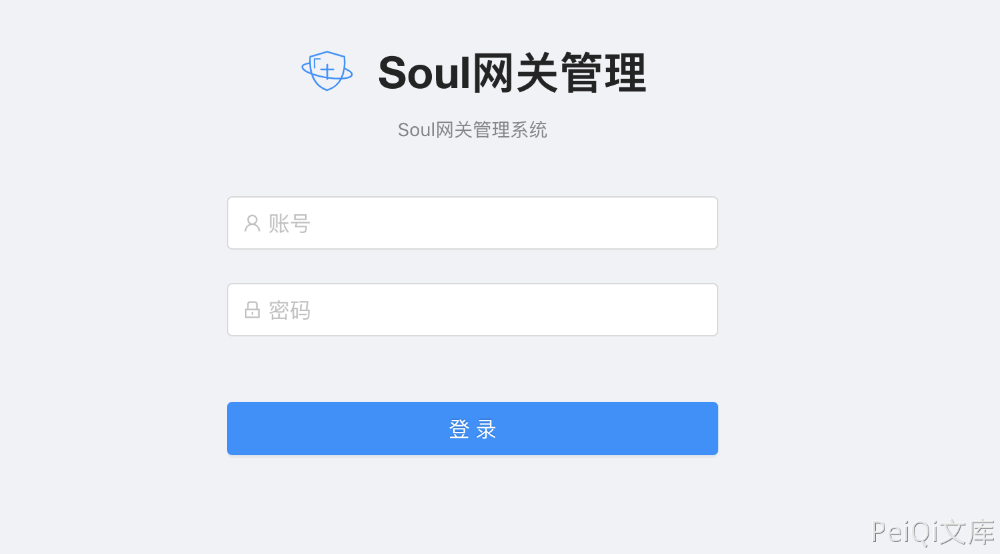
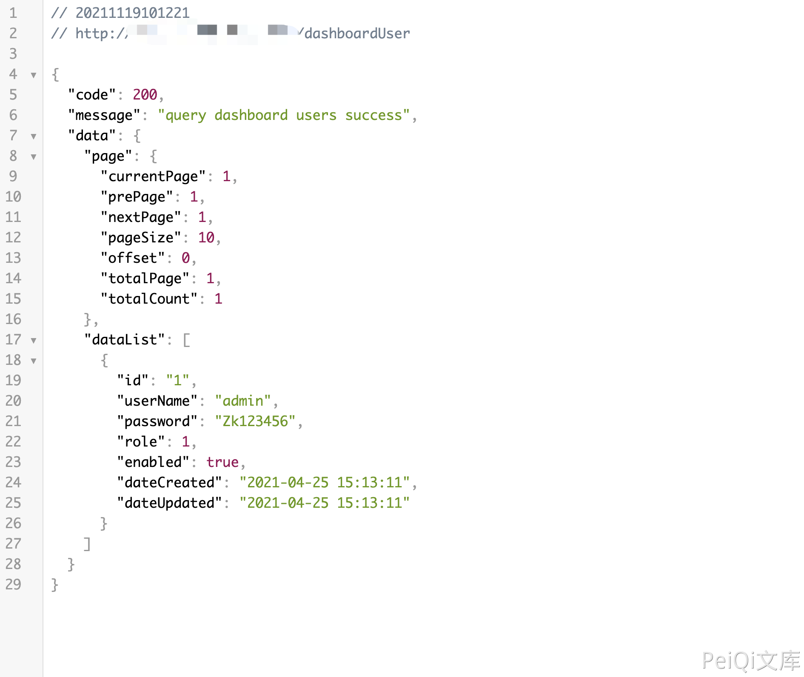

# Apache ShenYu dashboardUser 账号密码泄漏漏洞 CVE-2021-37580

## 漏洞描述

Apache ShenYu Admin爆出身份验证绕过漏洞，攻击者可通过该漏洞绕过JSON Web Token (JWT)安全认证，直接进入系统后台。 Apache ShenYu 是应用于所有微服务场景的，可扩展、高性能、响应式的 API 网关解决方案。

## 漏洞影响

<a-checkbox checked>Apache ShenYu 2.3.0</a-checkbox></br>

<a-checkbox checked>Apache ShenYu 2.4.0</a-checkbox></br>

## 网络测绘

<a-checkbox checked>
<a-button href="https://fofa.info/result?qbase64=dGl0bGU9PSJTaGVuWXUgR2F0ZXdheSI%3D">FOFA: title=="ShenYu Gateway"</a-button>
</a-checkbox>

## 漏洞复现

登录页面



验证POC

```python
/dashboardUser
```

