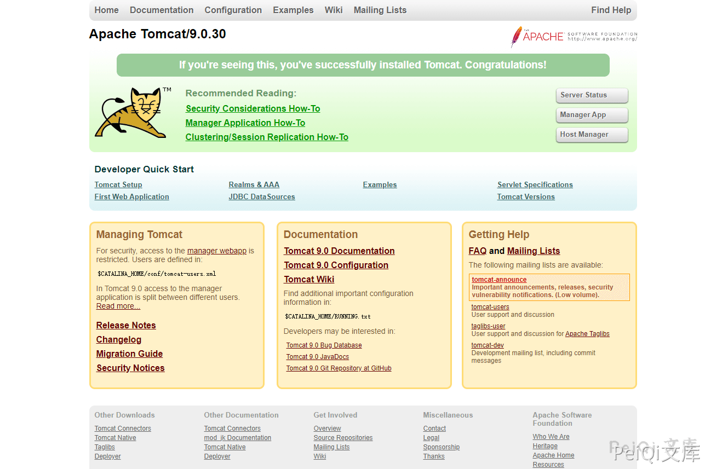
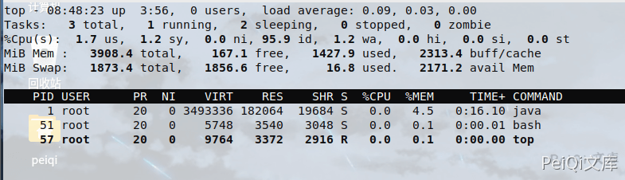
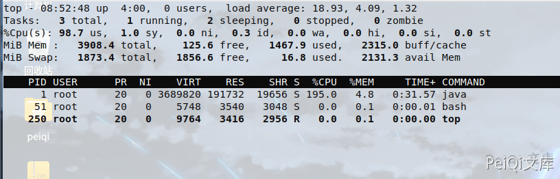

# Apache Tomcat WebSocket 拒绝服务漏洞 CVE-2020-13935

## 漏洞描述

2020年11月06日，360CERT监测发现`@RedTeamPentesting`发布了`Tomcat WebSokcet 拒绝服务漏洞` 的分析报告该漏洞编号为 `CVE-2020-13935` ，漏洞等级：`高危` ，漏洞评分：`7.5` 。

未授权的远程攻击者通过发送 `大量特制请求包` 到Tomcat服务器 ,可造成服务器停止响应并无法提供正常服务

## 漏洞影响

<a-checkbox checked>Apache Tomcat 10.0.0-M1-10.0.0-M6</a-checkbox></br>
<a-checkbox checked>Apache Tomcat 9.0.0.M1-9.0.36</a-checkbox></br>
<a-checkbox checked>Apache Tomcat 8.5.0-8.5.56</a-checkbox></br>
<a-checkbox checked>Apache Tomcat 7.0.27-7.0.104</a-checkbox></br>	

## 环境搭建

```shell
https://github.com/vulhub/vulhub.git
cd vulhub/tomcat/CVE-2020-1938
docker-compose up -d
```



## 漏洞复现

访问目标，查看版本是否在漏洞版本范围内


查看攻击前的内存使用情况



<a-alert type="success" message="CVE-2020-13935 EXP地址 : https://github.com/RedTeamPentesting/CVE-2020-13935" description="" showIcon>
</a-alert>

<br/>


```
tcdos    ws://192.168.51.133:8080/examples/websocket/echoStreamAnnotation
```

