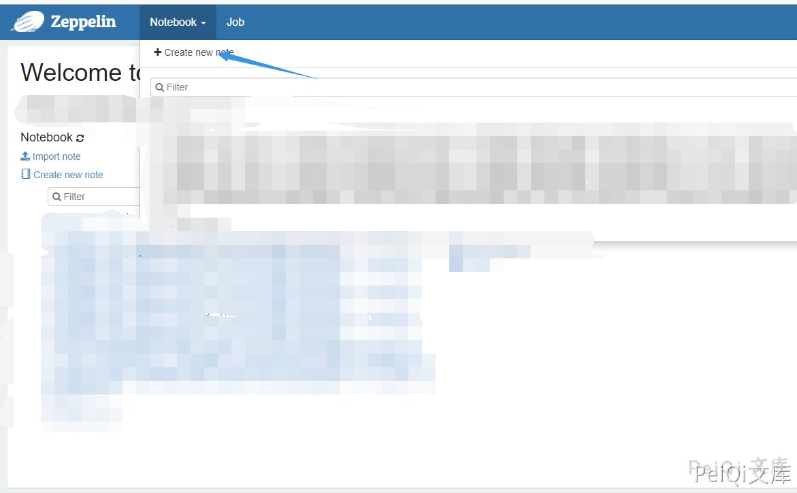

# Apache Zeppelin 未授权任意命令执行漏洞

## 漏洞描述

Apache Zeppelin 存在未授权的用户访问命令执行接口，导致了任意用户都可以执行恶意命令获取服务器权限

## 漏洞影响

<a-checkbox checked>Apache Zeppelin</a-checkbox> 

## 网络测绘

<a-checkbox checked>
<a-button href="https://fofa.info/result?qbase64=aWNvbl9oYXNoPSI5NjAyNTAwNTIi">FOFA: icon_hash="960250052"</a-button>
</a-checkbox>

## 漏洞复现

含有漏洞的页面如下

点击 创建一个匿名用户在用户页面执行命令即可

