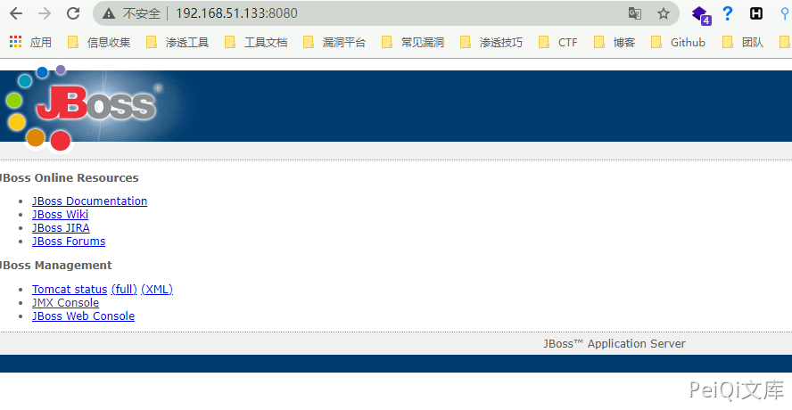
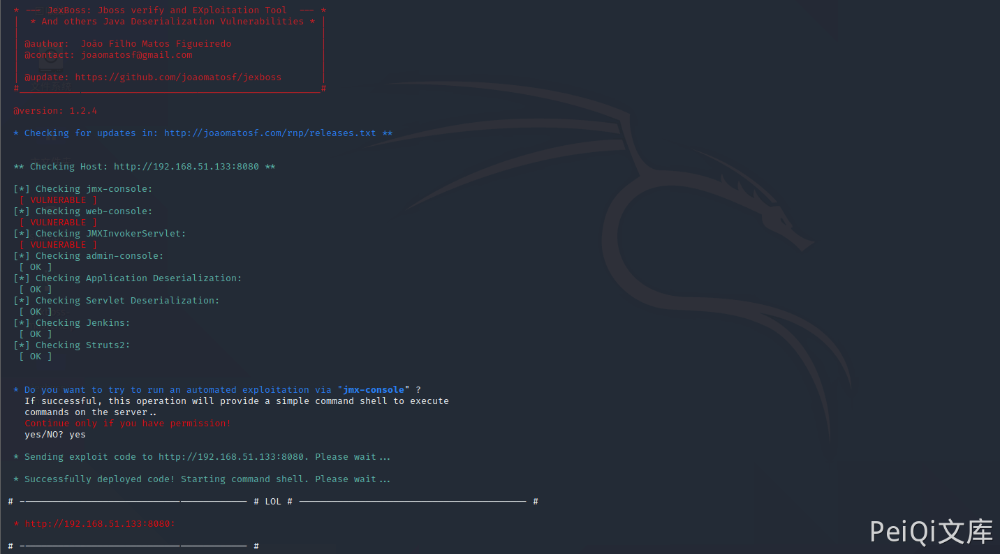
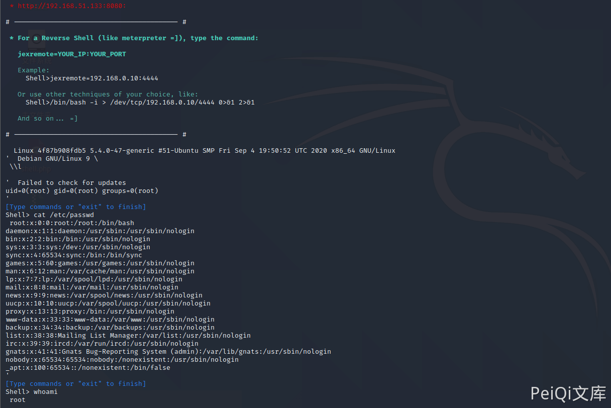

# JBoss 4.x JBossMQ JMS 反序列化漏洞 CVE-2017-7504

## 漏洞描述

Red Hat JBoss Application Server 是一款基于JavaEE的开源应用服务器。JBoss AS 4.x及之前版本中，JbossMQ实现过程的JMS over HTTP Invocation Layer的HTTPServerILServlet.java文件存在反序列化漏洞，远程攻击者可借助特制的序列化数据利用该漏洞执行任意代码。

## 影响版本

<a-checkbox checked>JBoss AS 4.x及之前版本</a-checkbox></br>

## 环境搭建

```plain
https://github.com/vulhub/vulhub.git
cd vulhub/jboss/CVE-2017-7504
docker-compose build
docker-compose up -d
```

## 漏洞复现

访问控制台



使用工具 [Jexboss](https://github.com/joaomatosf/jexboss) 进行漏洞扫描

```plain
python3 jexboss.py -host http://192.168.51.133:8080
```





成功利用漏洞执行命令
