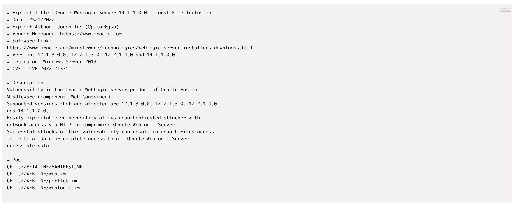

# WebLogic Local File Inclusion 本地文件包含漏洞 CVE-2022-21371

## 漏洞描述

2022年1月19日，绿盟科技CERT监测发现Oracle官方发布了1月关键补丁更新公告CPU（Critical Patch Update），此次共修复了497个不同程度的漏洞，此次安全更新涉及Oracle WebLogic Server、Oracle MySQL、Oracle Java SE、Oracle FusionMiddleware、Oracle Retail Applications等多个常用产品。Oracle强烈建议客户尽快应用关键补丁更新修复程序，对漏洞进行修复。

## 漏洞影响

<a-checkbox checked>WebLogic Server 12.1.3.0.0, 12.2.1.3.0, 12.2.1.4.0 and 14.1.1.0.0</a-checkbox></br>

## 漏洞复现

验证POC

```
.//META-INF/MANIFEST.MF
.//WEB-INF/web.xml
.//WEB-INF/portlet.xml
.//WEB-INF/weblogic.xml
```

